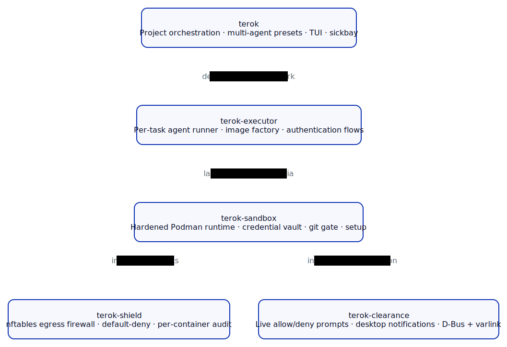

# terok-sandbox

The hardened-Podman runtime that powers terok.

terok-sandbox launches per-task containers with a credential vault,
a gated git server, and an installed egress firewall already in
place — so the calling tool can hand the container an agent and a
prompt, and the security boundary is set up before the agent ever
runs.



## What it provides

- **Hardened container lifecycle** — rootless Podman containers
  launched through a single `Sandbox` facade.  No daemon, no setuid,
  no escalation surface from the host.
- **Credential vault** — long-lived secrets stay on the host.  The
  container receives short-lived phantom tokens that are exchanged
  for the real value at the moment of use, scoped per route, audited
  per request.
- **Per-task git gate** — a token-authenticated HTTP mirror of the
  upstream repository.  Tasks clone and push only through the gate;
  the operator chooses whether the gate forwards to upstream
  automatically or only on human review.
- **Shield install + drive** — a thin adapter that installs the
  terok-shield OCI hooks at setup time and drives the firewall at
  runtime (allow / deny / up / down).
- **Clearance install** — wires the desktop notifier daemon
  (terok-clearance) onto every blocked outbound connection, so the
  operator can authorise destinations live without restarting the
  container.
- **Setup as one call** — `sandbox_setup()` brings the whole stack up
  idempotently; `sandbox_uninstall()` undoes it.

## Where it sits in the stack

terok-sandbox is the boundary layer.  Above it, single-task callers
([terok-executor](https://github.com/terok-ai/terok-executor)) and
multi-task orchestrators
([terok](https://github.com/terok-ai/terok)) treat the sandbox as a
black-box "give me a hardened container."  Below it, it composes
[terok-shield](https://github.com/terok-ai/terok-shield) for egress
filtering and
[terok-clearance](https://github.com/terok-ai/terok-clearance) for
the operator-in-the-loop verdict path.

The split exists so that callers do not need to understand
nftables, OCI hook wiring, vault sockets, or systemd unit lifecycles
to get a safe container.

## Installation

```bash
pip install terok-sandbox
```

For most users this dependency is pulled in transitively by
`terok-executor` or `terok`.  Install it directly only when building
a custom orchestrator on top of the sandbox API.

## Quick start

```python
from pathlib import Path

from terok_sandbox import RunSpec, Sandbox, SandboxConfig

sandbox = Sandbox(SandboxConfig())
sandbox.run(
    RunSpec(
        container_name="task-001",
        image="terok-l1-cli:ubuntu-24.04",
        env={},
        volumes=(),
        command=(),
        task_dir=Path("/var/lib/myapp/task-001"),
    )
)
```

See the developer guide for the full lifecycle and integration
patterns.
